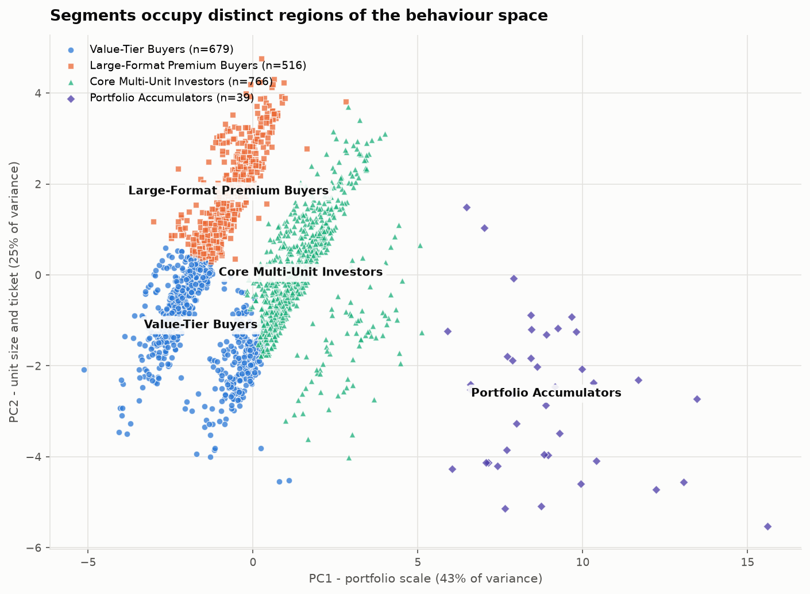

# Machine-Learning Buyer Segmentation and Investment Profiling for Real-Estate Market Intelligence

Unsupervised segmentation of 2,000 Parcl Co. Limited clients using their actual property-transaction behaviour, with a research paper and an interactive Streamlit dashboard.

**Unified Mentor × Parcl Co. Limited** · Financial Analytics & Real-Estate Market Intelligence

---

## The headline finding

Every attribute a client **declares** — client type, acquisition purpose, financing intent, country, gender, referral channel, satisfaction score and age — is statistically independent of what that client **buys**.

| Comparison | *p* | Cohen's *d* |
|---|---:|---:|
| Client type vs total investment | 0.928 | +0.010 |
| Acquisition purpose vs total investment | 0.553 | +0.030 |
| Financing vs total investment | 0.936 | +0.004 |
| Age vs total investment | — | *r* = +0.057 |

A demographic segmentation would therefore carry no investment information. The model is built entirely on transaction behaviour, and the practical consequence is stated plainly in the paper: **a client cannot be assigned to a segment from their registration form** — only from what they transact.

## The four segments

K-Means, *K* = 4, on ten standardised client-level behavioural features.

| Segment | Clients | Capital | Units | Avg ticket | Avg unit size | Buying window |
|---|---:|---:|---:|---:|---:|---:|
| **Core Multi-Unit Investors** | 766 (38.3%) | $1.137B (45.1%) | 4.12 | $361,784 | 1,194 sq ft | 448 d |
| **Value-Tier Buyers** | 679 (34.0%) | $643.6M (25.5%) | 3.38 | $281,834 | 942 sq ft | 383 d |
| **Large-Format Premium Buyers** | 516 (25.8%) | $639.5M (25.4%) | 3.01 | $411,771 | 1,351 sq ft | 340 d |
| **Portfolio Accumulators** | 39 (1.95%) | $100.3M (3.98%) | 7.69 | $338,827 | 1,118 sq ft | 552 d |

Portfolio Accumulators over-index on capital at **2.04×** their headcount — 39 clients worth $2.57M each.



## Why K = 4

Silhouette, Davies-Bouldin **and** Calinski-Harabasz all independently select *K* = 4 — the only configuration among 162 tested where the three agree.

| Metric | Value |
|---|---|
| Silhouette | 0.228 |
| Davies-Bouldin | 1.274 |
| Calinski-Harabasz | 618.8 |
| Behavioural variance explained (mean η²) | 0.374 |
| Stability across seeds (ARI) | 0.979 – 0.996 |
| Bootstrap stability, 100 × 80% subsamples | 0.914 mean ARI |
| Ward hierarchical agreement | ARI 0.573, AMI 0.614 |

### The trap this project had to avoid

The configuration with the **highest silhouette score overall (0.325)** was rejected. It reproduced the cross-tabulation of four binary flags at ARI 0.896 while explaining **0.3%** of investment-behaviour variance:

| Feature | η² under that "best" model |
|---|---:|
| `loan_flag` | 1.000 |
| `is_domestic` | 0.879 |
| `is_investment` | 0.856 |
| `total_investment` | 0.004 |
| `avg_property_price` | 0.002 |

Min-max scaling puts binary columns on the corners of the unit cube, where they are trivially separable, and the silhouette score rewards that without asking whether it means anything. The pipeline therefore applies a threshold-free **substantive-partition** gate: a segmentation is admissible only if it explains more variance in what clients *bought* than in what they *declared*. See `src/clustering.py::run_experiment`.

## Quick start

```bash
python -m venv .venv
.venv/Scripts/activate          # Windows
# source .venv/bin/activate     # macOS / Linux

pip install -r requirements.txt

python run_pipeline.py          # full analysis: cleaning → segments → figures
streamlit run dashboard/app.py  # interactive dashboard
```

`run_pipeline.py` regenerates every figure, table and model artefact the paper cites. All randomness is seeded and the age reference date is fixed at 31 December 2025, so results are byte-reproducible.

To regenerate the five analysis notebooks:

```bash
pip install -r requirements-dev.txt
python tools/build_notebooks.py   # generate + execute the notebooks
```

`tools/build_paper.py` renders the research paper from a Markdown source to
PDF. Both the source and the rendered paper are kept outside this repository
and distributed through the submission link instead, so that script only runs
in the authoring environment.

## Dashboard

Four modules, matching the project brief, plus a client explorer.

| Module | Contents |
|---|---|
| Buyer Segmentation Overview | Cluster distribution by headcount and capital; capital over-index table |
| Investor Behaviour | Capital and ticket distributions, unit counts, asset mix, financing rates |
| Geographic Buyer Analysis | Country choropleth, largest regions, segment mix within regions |
| Segment Insights | Descriptive statistics, index vs the book, and the strategy per segment |
| Client Explorer | Row-level table with CSV export |

Filters: country, region, acquisition purpose, client type, segment, financing, referral channel.

## Method

```
clients.csv (2,000)          properties.csv (10,000)
       │                             │
       │                    filter listing_status = Sold (7,305)
       │                             │
       │                    aggregate by client_ref
       └──────────────┬──────────────┘
                      ↓
        client-level table: 2,000 × 15 behavioural features
                      ↓
        encoding + scaling  (6 feature sets × 3 scalers)
                      ↓
        K-Means, K = 2…10   (162 scored configurations)
                      ↓
        gates: actionable (≥25 clients) + substantive (behaviour > declared)
                      ↓
        rank by index consensus, then silhouette  →  K = 4
                      ↓
        Ward hierarchical validation · bootstrap stability · PCA
                      ↓
        named segments + strategy  →  paper + dashboard
```

### Data cleaning notes

Both files are structurally clean — no missing cells, no duplicate identifiers. The real work was type recovery:

- **`sale_price`** arrives as text (`"$300,385.62"`); all 10,000 rows parse cleanly.
- **`client_ref`** is null in 2,695 rows, matching `listing_status = Available` **exactly**. This is unsold inventory, not missing data, and is excluded from aggregation rather than imputed.
- **Date formats** required evidence. `transaction_date` is provably month-first (its second component is always 1; read day-first it would place all 10,000 sales in January of two years). `date_of_birth` mixes `M/D/YYYY` with an ambiguous `NN-NN-YYYY` form in which both components are ≤ 12 for 855 rows — genuinely unrecoverable. Measuring age at **31 December 2025** neutralises it: age reduces to `2025 − birth_year`, and while 790 parsed dates differ between the two readings, **zero birth years do**.

## Repository layout

```
├── data/
│   ├── clients.csv, properties.csv        raw
│   └── processed/                         cleaned + client feature table
├── notebooks/
│   ├── 01_data_cleaning.ipynb             format forensics, integrity checks
│   ├── 02_eda.ipynb                       four EDA sections + the null result
│   ├── 03_feature_engineering.ipynb       ledger → client profiles
│   ├── 04_clustering.ipynb                the grid search and why the leader loses
│   └── 05_cluster_interpretation.ipynb    naming and recommendations
├── src/
│   ├── config.py                          paths, constants, validated palette
│   ├── data_cleaning.py                   Phase 1 + audit report
│   ├── feature_engineering.py             Phases 2–3
│   ├── preprocessing.py                   Phase 5, feature sets and scalers
│   ├── clustering.py                      Phases 6–7 + substance diagnostics
│   ├── interpretation.py                  Phases 8–9, rank-based naming
│   └── visuals.py                         all figures
├── models/                                preprocessor, kmeans, pca (joblib)
├── outputs/
│   ├── figures/                           15 PNGs
│   ├── tables/                            cleaning report, grid, η², profiles
│   ├── segmented_clients.csv              one row per client + segment
│   ├── cluster_profiles.csv               segment profile + strategy
│   └── run_summary.json                   every decision and metric
├── dashboard/app.py                       Streamlit application
├── docs/DEPLOYMENT.md                     Streamlit Cloud steps
├── tools/                                 notebook and paper builders
└── run_pipeline.py                        end-to-end entry point
```

The research paper is not held in this repository — it is distributed through
the submission link. Everything the paper reports is reproducible here:
`python run_pipeline.py` regenerates every figure and table it cites, and
`outputs/run_summary.json` records each selection decision, metric and
rejected candidate.

## Limitations

- The complete independence between declared attributes and behaviour suggests buyer-to-property assignment was generated randomly. Conclusions about *what does not predict behaviour* describe this dataset and should be re-tested on live data.
- 94% of clients bought three or four units, so the repeat-purchase dimension has little room to vary.
- Transactions are stamped to the first of the month, so `purchase_span_days` is precise only to ±30 days.
- **No income or wealth field exists.** Every segment name and profile describes observed purchasing behaviour; no affluence is inferred anywhere in this project.
- A silhouette of 0.228 means the segments partition a continuum, not naturally isolated islands. Clients near a boundary are genuinely intermediate.

## Accessibility

The four-segment palette (`#2a78d6` `#eb6834` `#1baf7a` `#4a3aa7`) was validated all-pairs for colour-vision separation against a light surface — worst-pair CVD ΔE 9.2, worst normal-vision ΔE 16.3. Colour is bound to segment identity rather than rank, so filtering never repaints the remaining segments; scatter plots carry distinct marker shapes as a second channel; and every dashboard chart is paired with a table view. The dashboard pins a light theme because no four-hue set clears the same gates against a dark surface.

## License

Released for educational and evaluation purposes as part of the Unified Mentor programme.
